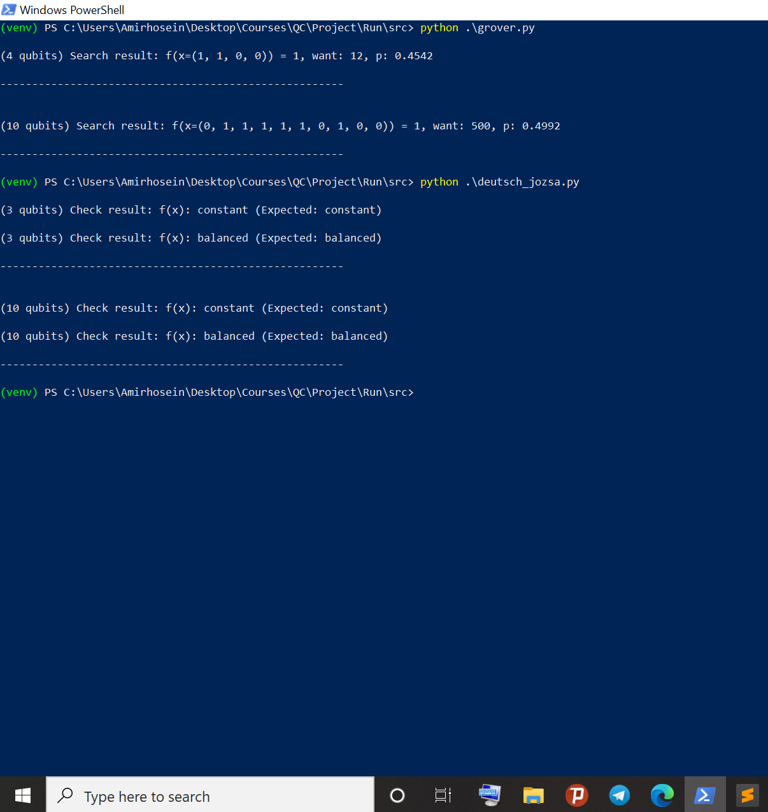

# Quantum-Computing-Algorithms:
## Here implemented the Grover and Deutsch_Jozsa search algorithms, as a matter of complexity, best in the world!

#### This project used python 3.9 and ran in an emulated Windows 10 Arm64-x86. Following instructions are required to run the codes. 

* Create and Activate virtual environment:

```
	python -m venv ./venv

	./venv/Scripts/activate
```

* Install following packages:

```
	python -m pip install numpy 

	python -m pip install matplotlib

	python -m pip install absl-py

	python -m pip install scipy
```

* The Grover and Deutsh-Josa algorithms implemented in /src directory, you can run each one via:

```
 	python .\grover.py 
	
	python .\deutsch_jozsa.py 
```

As seen above, the grover and deutsch-jozsa functions are called with various qubits according to the /doc. 


* Good to mention helper functions implemented in /lib directory, also there is another Grover's algorithm using sympy which is not
  efficient for high numbers of Qubits, to run it need to add package:

```
	python -m pip install sympy
```

* Any Question? 
Feel free to feedback ataulmohsin900@gmail.com
